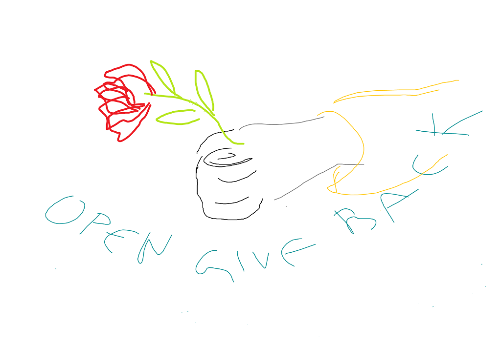
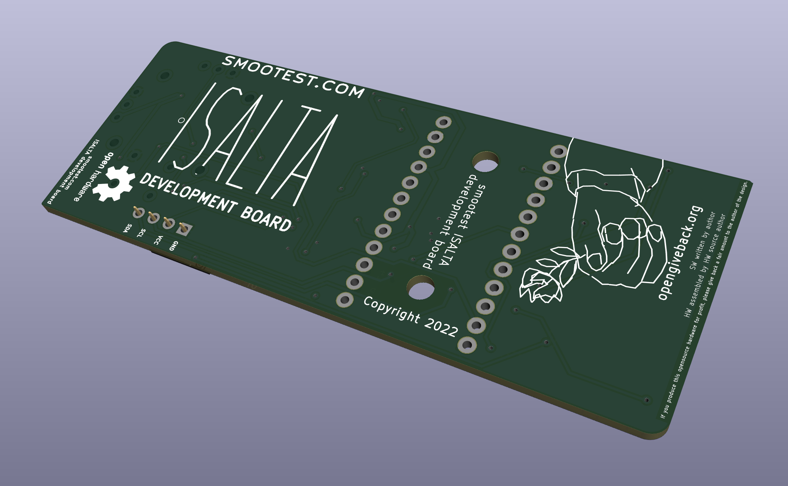

# OpenGiveBack.org
OpenGiveBack.org provides the explicit definitition to the moral obligation of paying back authors whose free, open-sourced designs you are selling (hardware or software) and earning profit for yourself. Enable people to circumvent procrastination of producing and selling someone else's open-sourced idea/code/designs when you know people need/want it. Every repository should have an opengiveback file and define the percentage they (verbally) require when someone produces and sells their open-source design, if they find the proposed default "fair" 15% of all sales profits not enough or too much.

# OpenGiveBack agreement 0.5

## OpenGiveBack Repayment Tiers
opengiveback, produce open source hardware, give back 15% profit to 30% payed price, fair to unicorn to equal partners
In an OpenGiveBack, you can be either an **author/publisher** of opensource software and/or hardware, or you can be a **producer/seller**, profiting from the open sourced work.

The actual amount returned to the **author/publisher** is always determined by the **producer/seller**, however the **author/publisher** can add an OpenGiveBack text file to his public open-source repository, in which he/she states what he considers to be a moral amount of OpenGiveBack for the design/product source files, AND to whom the total amount is to be payed (if the work is derived from previous work, or is made by multiple authors). All of these are defined in this OpenGiveBack.org definition text.

OpenGiveBack.org only provides a recomendation to donate back to authors of open-source, with no legal obligations and bindings, only moral ones.

The percentage of the profit to be returned can be chosen from the following OpenGiveBack Repayment Tiers, named scale, where the names represent the tier's desirability
- 5% **JUST TEASING**/I just reverse engineered your stuff, bro
- 10% **GIVING BACK A BIT**
- 15% **FAIR**
- 20% **ENOUGH**
- 25% **RESPECT**
- 30% **UNICORN**
- 50% **EQUAL PARTNERS**

There is also the option (**for the** **author/publisher** **ONLY**) to require he is not given anything. However, **producers/sellers** **CAN NOT USE THE 0% TIER, AS THAT DEFEATS THE PURPOSE AND MEANING OF OpenGiveBack.org, i.e. you can't/shouldn't put the OpenGiveBack.org logo on the open-source based product if you don't donate at least 5% of total profits back to the** **author/publisher** **, and the repayment tier chosen should be stated below the logo and OpenGiveBack.org text.**

The special, **"author/publisher"-only"** repayment tier is
- 0% (in author's OpenGiveBack repository file only) **NO NEED**/Please DO NOT transfer any funds to me

## What exactly is the OpenGiveBack?

OpenGiveBack defines ways to profit from producing OpenSource Hardware while retaining morality, by establishing an amount of profits per sold hardware unit to be transferred to the original designer who published his solution to opensource.
Where there is only 1 designer, this is sufficient, however when the work is based on previously published opensource design by another author, this convention either leaves it to the author to assess how much value for the application he has added/how much the previous work is worth, and do his own OpenGiveBack if he so feels the need to.
Authors can also set an OpenGiveBack index, a percentage defining how much of the OpenGiveBack cash should be given to him, and how much to authors he based his work on. If defined, there should be an OpenGiveBack.txt file in the project directory.
Every OpenGiveBack payment must include a note on it's type.
OpenGiveBackOnlyForYou is a payment not having the moral obligation of propagating to earlier authors, and the default form of OpenGiveBack used when otherwise not defined (to prevent too much requirement of self doubt and overthinking on the recipientduring normal application of this process, the intent is to reward the author not punish him). To avoid the definition including requirements of too much microtransactions, the relevant granularity for further propagation is set to $10, meaning you as a recipient of OpenGiveBack funds should only send to other authors when their parts accumulate over 10$.`	
OpenGiveBackPleasePropagate/PleaseRecurse informs the author to redistribute the funds to the other/previous authors the work of whose the opensource design is based upon.

By proclaiming the desired profit sharing concept in the project directory, much like already done with the opensource license, you direct what happens with your work and avoid confusion should other be created.

The tier's name can be part of a custom sentence in the OpenGiveBack repository file/below the OpenGiveBack logo on the PCB/software About screen, just keep the tier name in all capital letters so that it is clear and obvious.

Here are examples of how you would state the desired OpenGiveBack repayment tier (default sentences, if customized please retain the tier name, and in all capital letters):

- NO NEED for giving back money
- JUST A LITTLE BIT of work
- a FAIR amount of work
- ENOUGH work
- created a UNICORN for you

If you do not state the tier name, the default **fair** tier is always implied.

An entire category, much like opensource licenses only mostly in the moral dimension, is created by this. This is chosen so that application of OpenGiveBack can not lead to various, location/legislation dependent obligations arising for those who apply OpenGiveBack. It is entirely voluntary and non-compulsory. It is the same reason why 
So as to be compatible with opensource licenses, the obligation required by OpenGiveBack is purely a moral one.

All consequences of not following any of these rules are moral only.
Unless an opensource project has explicitly stated it belongs to the "NO NEED for money" category, it is hereby implied that every opensource project you make profit from producing, is eligble for OpenGiveBack.

OpenGiveBack is an attempt at a written social convention, a definition of
Please donate to OpenGiveBack.org, allow us to keep being online and keep refining the idea of fair and moral openhardware production profit sharing.

Why not give the people who already invested work in the things that interest us, somewhat of a passive income source?
OpenGiveBack is an open-ended set of guidelines to inspire and ease giving back to opensource solution designers, when their work is sold for profit by a third party.
Why? Because if someone made something useful, and you're making profit off of their work, it's only fair to give some of it back to them.
Primarily, for now, OpenGiveBack is inspired by OpenSource Hardware projects, and aims to inspire giving back and make it easy by resolving some of the unknowns and ambiguosities, by wraping it all up in a brand new social convention - OpenGiveBack.
Also, individual producers and sellers of opensource hardware with the OpenGiveBack logo could incentivize conscientiouss people to pay a little more attention to this, support original designers a bit more, and make the world a somewhat better place.

Privacy is also very important, OpenGiveBack.org has a givebacktally option, however only when both giver and designer agree is it made public. A way for the author to automatically avoid this, is to have the keyword "private" in his OpenGiveBack config file in the repository in question

Like maestro singers who were doused with flowers, so shall the most popular authors on opengiveback.org receive the title of opengiveback's maestro, thus earning free promotion for his opensource work, and through the morality of those who produce it and suggestions from opengiveback.org, 
Because if someone gave you seeds to plant and grow beautiful flowers, it's only fair to give some back to the someone in question.

"I prefer to produce and supply hardware for my designs myself" option, addition to the logo meaning you prefer people get the open source hardware produced by you
"I prefer to produce and supply hardware for my designs myself"
"Designer also makes and supplies this opensource hardware, but this is 
DESIGNER ALSO SUPPLIES PRODUCED HARDWARE
(THIS NOT PRODUCED AND SOLD BY DESIGNER)

About opensource software, to simplify it shall be established hardware and software are equally valuable, unless noted otherwise. If only a part of opensource software is used, but it is the basis and foundation to any additions, it can still be said software has value of half of device, and base necessary opensource sofware used all has at least half the value of all opensource software, unless otherwise decided.

## Example of OpenGiveBack application

For example, if you have made entire hardware design, and are using someone else's opensource software in it's original form, a "fair" tier of OpenGiveBack would be 50% of the 15% )7.5% of profits) for "fair" tier, and it should be noted in the standard OpenGiveBack note with only software mentioned on the PCB.
If however you have added features into the opensource with significant added value to the project, it would be fair to reduce the portion given to original opensource sw author down to at least 50%, so that he gets 3.75% of profits or more (if several opensource solutions are integrated by yourself, 50% of the software part, is shared among these solutions, and parts are equal or arbitered by you by significance to the project and added value to the project of each of the softwares, otherwise if you are using an already integrated solution, it is by default the integrrator's (moral) responsability to further divide what you send him, unless he explicitly stated in his OpenGiveBack file in his repository, that he wants the payee to distribute among people who's software he integrated. Any integrator is to get no less than 20% of the total sum.

The easiest job in determining the moral OpenGiveBack amount, is when assembling open source projects made from hardware and software made by the same person/team, in that case, there is only one recipient for the 15% profit share of the "fair" opengiveback tier.
Defining new customs, to rtain honor and morality in the remote social landscape of contacts you never meet yet are using their work, published into opensource or with express permission but with no strings attached. For instance, if there are several suppliers of an assembled open hardware design, it could be more morally correct to choose the one with added OpenGiveBack.org logo, that takes care of the author too.

## Legal Disclaimer
No warranties or legal obligations of any kind, express or implied, are imposed by this document. This document is only a proposition to, calling upon their morals, ease retention of morality by producers of open hardware or sellers of open software, with a concrete definition of how much of the profits and to whom to donate. This definition does not claim to be the only righteous way, it is just a definition reflecting it's author's (Milos Stojanovic) thoughts, values and experience.

This text has to bee shared in it's entirety and unchanged. Only OpenGiveBack.org author (Milos Stojanovic) can revise this text.

Use this as is on your own responsibility, no damages or injuries caused by or said to be caused by this document can be charged to the author of OpenGiveBack.org (Milos Stojanovic). In case any judicial claims should rise, they are to be settled by the court in Kursk, Russian Federation.

If you do not agree with this disclaimer, please do not use OpenGiveBack agreement. Otherwise, please do.

## Contributing to OpenGiveBack.org

If you have any questions, or have percieved some inconsistencies with this agreement and the actions it proposes, or you have some suggestions, please open A new issue on the OpenGiveBack GitHub Repository](https://github.com/serbs-software/OpenGiveBack/issues/new/choose)

# How should the logo look like on a PCB?
Here is an example of using OpenGiveBack.org logos on a PCB from the [ISALTA project](https://github.com/serbs-software/isalta/).

The vector graphics and KiCad example are included in the https://github.com/serbs-software/OpenGiveBack/ repository.
